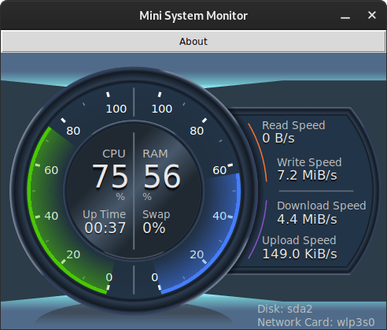

# Mini System Monitor

    

    <strong>
        Mini version of <a href="https://github.com/hakandundar34coding/system-monitoring-center">System Monitoring Center</a>
    </strong>

    </a>
    
    

    

### Features:
- Monitoring CPU, RAM, Disk, Network usage
- About 40 MiB RAM consumption
- Free and open source

### Dependencies:
Dependencies for running from source code:
- `python3 (>=3.6), python3-cairo, python3-tk, python3-pil`

### Screenshots:

