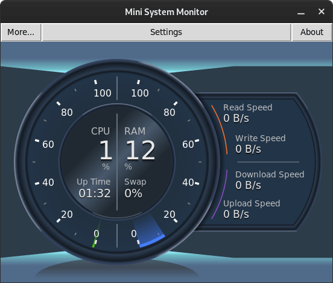

# Mini System Monitor

# Work In Progress

    

    <strong>
        Mini version of <a href="https://github.com/hakandundar34coding/system-monitoring-center">'System Monitoring Center'</a>.
    </strong>

    </a>
    
    

### Features:
- Monitoring CPU, RAM, Disk, Network usage
- Optimized for low CPU usage and fast start
- Supports ARM architecture
- Free and open source

### Installation:
- Mini System Monitor is installable from Flatpak.

### Dependencies:
- `python3 (>=3.6), python3-cairo, python3-tk`

### Screenshots:

